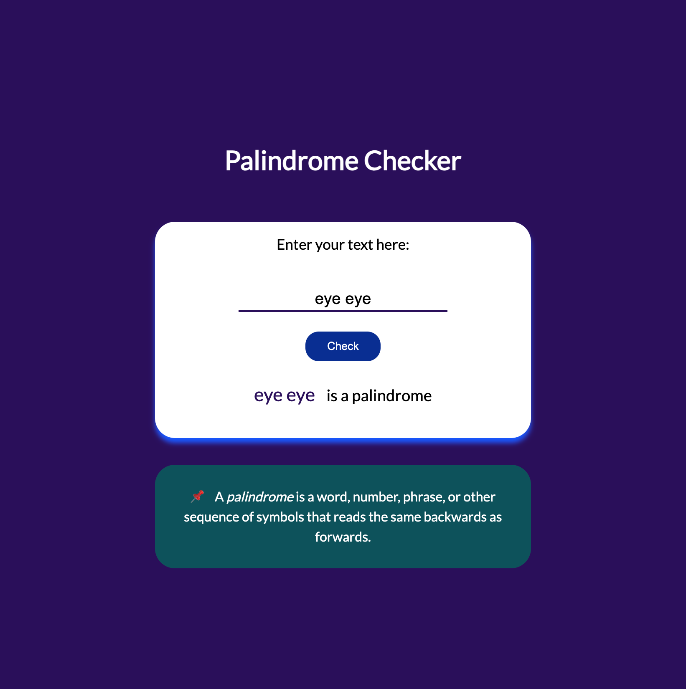

# freeCodeCamp - Palindrome Checker Project

This is a solution to the Palindrome Checker Project. 

The Palindrome Checker is a simple web application that allows users to input a string of characters and check if it is a palindrome. A palindrome is a word, phrase, number, or other sequence of characters that reads the same forwards and backwards, ignoring spaces, punctuation, and capitalization. The project utilizes JavaScript to clean the input string by removing non-alphanumeric characters and converting it to lowercase for comparison.

### The challenge

Users should be able to:

- See the result displayed on the screen indicating whether the input string is a palindrome or not.
- Use the application to check palindromes with various types of input strings, including words, phrases, numbers, or sequences of characters.

### Link

- Live Site URL: (https://roaring-marshmallow-52691e.netlify.app/)

### Screenshot

